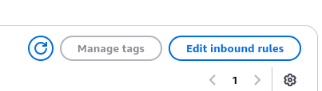
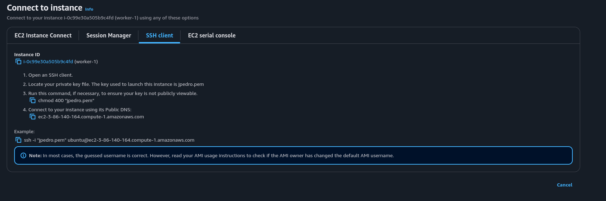

# How-to: Como Configurar um Cluster na AWS: Múltiplas Instâncias de EC2

### Sumário

## First Things First

Ao entrar no ambiente de aprendizado da AWS, vá até a seção de módulos e dirija-se até o botão "Iniciar os laboratórios de aprendizagem da AWS Academy". Ao clicar, você será direcionado ao terminal básico da AWS. Pressione o botão *Start Lab*, no canto superior direito, e espere até o ícone verde à mesma altura, no canto superior esquerdo, mudar a cor para verde.


Após isso, basta clicar neste mesmo ícone verde.


## Criando Instâncias EC2

Neste trecho do tutorial, vamos criar uma insância master e mais três workers, todos iguais entre si.

### Instância Master

Ao entrar no console da AWS, não perca tempo e vá direto à barra de pesquisa. Busque por EC2 e clique na primeira opção, de mesmo nome, e, no painel, clique em Launch Instance.


Antes de começarmos a configurar, certifique-se de dar um nome adequado à sua instância, no campo *Name and tags*. Neste caso, se tratando da primeira instância, é de bom grado conferir a ela o nome de *master*. As outras, consequentementes, serão chamadas de *worker1*, *worker2* e *worker3*.

Para configurar a instância, basta seguir estas configurações:
- Application and OS Images: Ubuntu


- Instance Type: t2.micro


- Key pair (login):
  - Clique em *Create new key pair*
  - Dê um nome para a chave
  - Mantenha RSA e .pem selecionados. Trata-se de uma chave simétrica, em que quem tiver acesso ao arquivo, terá também acesso irrestrito às máquinas. Por este motivo, tome cuidado: guarde o arquivo em um lugar seguro.
  - Após a geração da chave, selecione-a no campo *Key pair name*


Antes de concluir essa etapa, abra em uma nova janela o *cloud shell* da AWS, que está situado no canto superior direito (mais para o centro), com um ícone clássico de shell.


Após abri-lo, basta ir em: Actions -> Upload File -> Carregue o arquivo `.pem` recém-criado e baixado por você. Este arquivo será fundamental para o estabelecimento da conexão entre as instâncias.

- Network Settings: Clique em *Create security group*

Feito isso, basta clicar em *Launch instance*, concluindo, assim, a criação da primeira instância.

### Instâncias Workers

Antes de mais nada, ao voltar à listagem de instâncias, verá a recém-criada instância mestre.


O que faremos agora é seleciona-la e, após isso, clicar em *Launch instance*. Por que? Porque agora serão criadas todas as instâncias *workers*. Você pode adicionar uma *tag* a elas, como "*worker*-1", por exemplo. As configurações serão as mesmas que a da instância *master*. A única diferença tem relação com o *security group*, na seção *Networking Settings*. Nela, selecionaremos a opção *Select existing security group* e, no campo *select* que surgir logo abaixo, escolheremos o grupo *launch-wizard*, que foi criado no instante em que a instância mestre foi configurada.


Feito isso, basta finalizar a criação desta instância e replicar o processo para as outras duas restantes.

## Estabelecendo Conexão Mútua Entre Instâncias

No menu lateral esquerdo, dirija-se a *Security Groups*. Será aberta uma página em que há uma listagem de todos os grupos de segurança, incluindo o recém-criado *launch-wizard*.


Clique no ID dele e, em seguida, na porção à direita da tela, clique em *Edit inbound rules*, ou "editar regras de entrada".




Clique no botão *Add rule*, ou "Adicionar regra":


Escolha a opção *All TCP*:


Agora, na mesma linha em que selecionou a opção *All TCP*, digite "sg" no campo em que há uma lupa e escolha a opção sugerida que menciona o *launch wizard*.


O que isso significa? Entre as instâncias, todas as portas estão ligadas, liberadas entre elas. Feito isso, salve a nova regra no botão *save rules*, situado no canto inferior direito.

## Gerenciando chaves SSH

Abra o cloud shell novamente e, de preferência, em uma nova janela do navegador. Após isso, para listar os arquivos, bem como todas as pastas ocultas da máquina, execute o comando:

```shell
ls -la
```

Perceba que a chave `.pem` que foi carregada na máquina também está presente na listagem. O que faremos é movê-la para a tradicional pasta `.ssh`. Para isso, execute os seguintes comandos:

```shell
# caso a pasta .ssh nao esteja presente, crie-a com o seguinte comando:
# mkdir .ssh
```

```shell
# mova a chave para a pasta .ssh
mv yourKey.pem .ssh/
```

```shell
# se dirija ate a pasta
cd .ssh/
```

Volte à listagem de instâncias e selecione o primeiro worker criado por você, clicando em seu id. Na porção superior à direita do painel da instância, clique no botão *Connect* e dirija-se até a aba *SSH client*. Você será apresentado a essa tela:



Neste ambiente, são mostrados comandos com os quais é possível conectar de fato a instância à rede do cluster que estamos configurando.

Voltando ao Cloud Shell, edite as permissões pertinentes à chave `.pem`. Para isso basta executar:

```shell
chmod 400 yourKey.pem
```

O que `400` significa nesse contexto?

**4** - permissão de leitura apenas ao proprietário
**0** - nenhuma permissão ao grupo
**0** - nenhuma permissão a qualquer um

Basicamente: é garantido somente o direito de leitura ao proprietário. Todo o restante, pertencente ou não ao grupo de máquinas, está proibido de fazer quaisquer ações com o arquivo.

Em seguida, o próximo passo será copiar a chave `.pem` a essa instância configurada. Para isso, dentro da pasta `.ssh`, execute o seguinte comando:

```bash
scp -i yourKey.pem yourKey.pem ubuntu@<instance_name>:~/.ssh/
```

O `instance_name` faz referência ao nome dado à máquina criada. Como estamos utilizando o `worker-1` como exemplo, copie seu respectivo nome e substitua o campo com o mesmo.

Você será questionado do seguinte modo:

```shell
This key is not known by any other names
Are you sure you want to continue connecting (yes/no/[fingerprint])? yes
```

A sua resposta será *yes* e sem pensar duas vezes. Quer saber o motivo? A máquina que está enviando a chave nunca estabeleceu antes uma conexão com a instância. O *fingerprint* nada mais é do que uma forma de verificar a identidade servidor ao qual você está tentando se conectar. Para isso, é feita uma checagem de um identificador gerado pela chave pública de criptografia.

Feito isso, copie e execute o último comando da página de conexão da instância, que está na aba *SSH Client*, aberta recentemente. Ele é suficiente para que seja possível se conectar a cada instância em sua respectiva janela no cloud shell.

Como sugerido, para finalizar, basta repetir o mesmo processo para todas as outras máquinas, incluindo a master. Utilizar o primeiro worker foi apenas um modo de padronizar as nossas ações neste tutorial. Para isso, crie mais três (3) abas no terminal, uma para cada instância restante e, dentro da pasta `.ssh` em cada uma das janelas, siga os passos executados para a conexão com o primeiro worker.

Se ainda tem dúvidas do que fazer:
- selecione outra máquina e vá até a aba *SSH Client*;
- copie a chave `.pem` à instância, executando o comando `scp` dentro da pasta `.ssh`;
- copie o último comando, o de exemplo de conexão;

## Estabelecendo Conexão da Master com os Demais Workers

Até este momento, você deve ter quatro (4) abas abertas, cada uma conectada a cada instância AWS. Faremos o seguinte: na aba no cloud shell em que a instância mestre está conectada, nos conectaremos aos demais workers, utilizando exatamente o último comando da seção *SSH Client*, frequentemente visitada no capítulo anterior.

Para isso, basta:
- em uma seção de um dos workers, copiar e executar o último comando na aba *SSH Client* (novamente, dentro da pasta `.ssh`);
- confirmar a conexão, com o fingerprint;
- apertar `ctrl + D`, para se desconectar e voltar à master;
- repetir o processo para os demais workers.

Lembre-se: este é um processo da master para os demais workers. O inverso não será feito.

## Adicionando Chave Privada Ao Agente de Autenticação

Diferentemente do processo anterior, os passos a serem seguidos neste capítulo serão realizados em todas as máquinas.

Novamente, dentro da pasta `.ssh`:

```bash
eval `ssh-agent`
```

```bash
ssh-add yourKey.pem
```

O próximo passo envolve adicionar o IP privado de cada instância à lista de hosts. Para isso, a partir da lista de instâncias, basta selecionar uma máquina e procurar pelo endereço IPv4 privado da máquina. Com esse endereço, será possível editar o arquivo de listagem de hosts do seguinte modo:

```bash
sudo nano /etc/hostos
```

O nano permitirá editar o arquivo `hosts`. Você pode optar pelo editor de texto de preferência. No arquivo, insira os IPs privados de cada instância juntamente com um alias para identifica-los:

```
<master_private_ip> master
<worker-1_private_ip> worker1
<worker-2_private_ip> worker2
<worker-3_private_ip> worker3
```

Tendo editado o arquivo em todas as instâncias, algumas particularidades precisam ser consideradas.

### A Partir da Master

Na master, execute o seguinte comando para cada um dos workers:

```bash
ssh ubuntu@workerN hostname
```

Por `N`, em `workerN`, entenda que pode ser um worker de qualquer numeração (worker1, worker2 ou worker3), já que esse comando será executado para cada um dos workers

Você se deparará com a mesma confirmação de fingerprint como das últimas vezes. Aceitando, verá que o ip da máquina ao qual está solicitando o endereço aparecerá. Já está claro, mas perceba que esse tipo de pergunta não se repetirá ao executar o comando novamente.

### A Partir dos Workers

Com os workers, o processo será similar:

```bash
ssh ubuntu@master hostname
```

## Configurando a MPI

Para instalarmos a MPI em cada um dos nós, basta executarmos o seguinte comando:

```bash
sudo apt update && sudo apt install openmpi-bin openmpi-common
```

Por fim, na master, para obter o IP de cada um dos workers utilizando-se da MPI:

```bash
mpirun --host worker1,worker2,worker3 hostname
```
